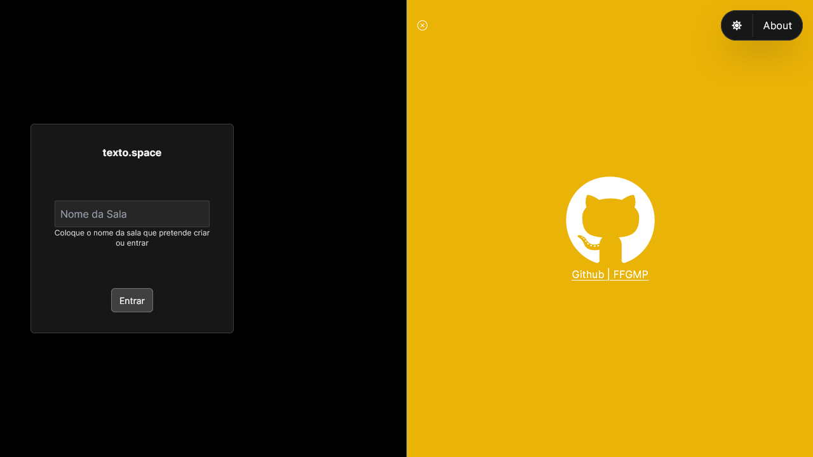

## share-text.ts

This project is a showcase of a web application designed for creating and sharing text online via custom rooms. The application provides a user-friendly interface and robust functionality to facilitate seamless text sharing among users. It is highly performant, ensuring efficient and real-time text transfers.

## Showcase

### Home page, here you can change the theme and toggle the about page




### Light theme


### Write the room name


### Redirected to the specified room, where the user can write anything


## Creation Process

Technologies used: Next.js, TailwindCSS, Zod

The foundation of this project was laid using the dynamic and adaptable Next.js framework. The primary aim of this venture was to build a sturdy and high-performance text sharing platform, facilitating users to share text effortlessly online via custom rooms.

Throughout the development phase, the design aspect of the page was given significant attention, alongside a strong emphasis on functionality and performance. The goal was to ensure the text sharing process was not only swift but also reliable and intuitive for users.

With a focus on speed and efficiency, the project strives to deliver an exceptional user experience. Users can swiftly create their custom rooms and share text.

## Key Features

- ✔️ Seamless Text Sharing: Enables users to share text effortlessly.
- ✔️ Custom Rooms: Provides the ability to create personalized rooms for text sharing.
- ✔️ Temporary Text: All text rooms are erased when the websockets server is shutdown.

## Running the Project Locally

First, run the development server:

```bash
npm run dev
# or
yarn dev
# or
pnpm dev
# or
bun dev
```

Open [http://localhost:3000](http://localhost:3000) with your browser to see the result.

You can start editing the page by modifying `app/page.tsx`. The page auto-updates as you edit the file.

This project uses [`next/font`](https://nextjs.org/docs/basic-features/font-optimization) to automatically optimize and load Inter, a custom Google Font.

## Learn More

To learn more about Next.js, take a look at the following resources:

- [Next.js Documentation](https://nextjs.org/docs) - learn about Next.js features and API.
- [Learn Next.js](https://nextjs.org/learn) - an interactive Next.js tutorial.

You can check out [the Next.js GitHub repository](https://github.com/vercel/next.js/) - your feedback and contributions are welcome!

## Deploy on Vercel

The easiest way to deploy your Next.js app is to use the [Vercel Platform](https://vercel.com/new?utm_medium=default-template&filter=next.js&utm_source=create-next-app&utm_campaign=create-next-app-readme) from the creators of Next.js.

Check out our [Next.js deployment documentation](https://nextjs.org/docs/deployment) for more details.
